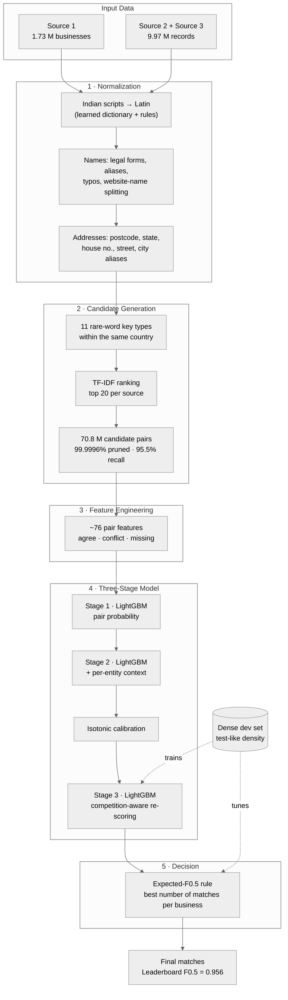

[README (2).md](https://github.com/user-attachments/files/32877618/README.2.md)
# Business Entity Resolution at Scale

### Amazon ML Challenge 2026 · Team **404 Founders**

> Matching **1.7 million** businesses against **10 million** noisy, multilingual records from two other sources —
> across India, the US and an unseen country (France) — on a **16 GB laptop**, with **99% precision**.

---

## 📌 Highlights

| | |
|---|---|
| 🏆 **Final leaderboard score** | **Macro F0.5 = 0.956125** |
| 📈 **Improvement journey** | 0.887 → **0.956** by redesigning training to match test density |
| 🎯 **Precision / Recall** (dev) | **0.990 / 0.917** — tuned for a precision-weighted metric |
| ⚡ **Search space reduction** | 1.73 × 10¹³ possible pairs → 70.8 M candidates (**99.9996%** pruned) |
| 🔎 **Blocking recall** | **95.5%** of true matches kept in the shortlist |
| 🌍 **Generalisation** | France was absent from training — handled by generic, country-agnostic rules |
| 💻 **Hardware** | Full pipeline runs on a **16 GB Windows laptop**, crash-safe and resumable |

---

## 🧩 The Problem

Three data sources describe the same real-world businesses in different ways:

| Source | Business name | Address |
|---|---|---|
| Source 1 | Akash Advisory Solutions Pvt Ltd | 12, MG Road, Bengaluru 560001 |
| Source 2 | आकाश एडवाइजरी सॉल्यूशंस | MG Rd, Bangalore, KA |
| Source 3 | akashadvisory.com | #012 M.G. Road, 560001 |

For every Source 1 entity, the task is to find **all** Source 2 / Source 3 records describing the same business —
or correctly predict **no match**.

**Why it's hard**
- **Scale:** 1.7 M × 10 M records — comparing every pair is impossible.
- **Noise:** typos, abbreviations (Pvt, Ltd), shuffled words, website-style names, digit-for-letter swaps (Gu1f).
- **Multiple scripts:** names in Devanagari, Tamil, Kannada, Malayalam, Telugu and Latin.
- **Look-alikes:** in the data, two records with the *same* name are the same business only **50.8%** of the time.
- **Metric:** F0.5 weights precision **twice** as much as recall, and "no match" is a valid, scored answer.

---

## 🏗️ Architecture

### 1. Normalization — normalization.py
Learned from training pairs, then frozen (never refit on test):
- **Indian-script → Latin** dictionary mined from true pairs, with rule-based transliteration as fallback.
- **Name cleaning:** legal-form removal, DBA/aka aliases, typo repair (Pirvate → private), website-name splitting (urbanlakshmiservices.com → urban laxmi services).
- **Address parsing:** postcode (US ZIP, Indian PIN, French CP), state/region, house number + suffix, street, old/new city names (bombay → mumbai).

### 2. Candidate Generation (Blocking) — blocking.py
Instead of comparing everything, each record emits keys built from its **rarest** tokens (IDF-ranked), so generic words like *"services"* or *"road"* never create huge blocks.

| Key type | Catches |
|---|---|
| Rarest name word(s) | distinctive names, shuffled word order |
| Name with spaces removed / first letters only | spacing differences, truncated names |
| Consonant skeleton of the name | vowel typos |
| Order-free name | the same words in a different order |
| Postcode, house number and address words | matches where the name is written differently |
| Name initials + address | abbreviated names (HLE Sons ↔ H L E) |

Every key is **country-prefixed**, so the country is treated as an open set — new countries work with zero code changes.
Candidates are then ranked with a character n-gram TF-IDF cosine and cut to a top-K shortlist.

### 3. Feature Engineering — features.py
~76 pair features, each encoded as **1 = agree, 0 = conflict, NaN = missing**, so a missing field is never mistaken for a mismatch:
- **String similarity:** Jaro-Winkler, Levenshtein, token-set/sort ratios, TF-IDF cosine, acronym match
- **Rarity:** IDF of shared vs. unshared tokens, name frequency, *"name is unique"*
- **Address agreement:** postcode, state, house number, street similarity, number conflicts
- **Cross-checks:** *name high but address low*, *name high but house number conflicts*, …

### 4. Three-Stage Model — model.py, train_dense.py, stage3.py
- **Stage 1:** LightGBM pair classifier with entity-grouped out-of-fold predictions (no leakage).
- **Stage 2:** adds per-entity context — rank, gap to best, margin over runner-up, support from the other source.
- **Calibration:** isotonic regression on a held-out split.
- **Stage 3:** re-scores on a dense dev set where every record faces its real competitors; kept **only** if it wins on a held-back check set (+0.0016).

### 5. Decision Rule — decide.py, tune_on_dev.py
For each entity, picks the number of top candidates *k* (including *k = 0*) that **maximises expected F0.5**. 224 rule variants were searched on the dev set and the winner re-verified with the production decision code.

---

## 💡 The Key Insight: Train Like You Test

Our first model scored **0.98** on validation — and **0.887** on the leaderboard.

**Why?** It was trained on a *thin* sample where each business rarely saw look-alikes. The real test set is *dense*: every business has many near-duplicates (same generic name in other cities, same street with a different business). The model had never learned to reject them.

**The fix** — make every step look like the test:
1. **Dense training** — each sampled entity is matched against **all** training records, so its look-alikes appear exactly as in test.
2. **Dense dev set** — test-like density with known answers; it predicts the leaderboard within ~0.01.
3. **Size-independent features** — rarity scaled by the data size, so a pair gets the same features in train, dev and test.

| Version | Change | Leaderboard |
|---|---|---|
| v0 | Thin training sample | 0.887 |
| Dense (first try) | Dense training + all context features | 0.83 ⚠️ |
| Dense + fix | Removed reverse-view context that leaked a train/test mismatch | 0.954 |
| + Dev-tuned rule | Decision rule tuned on dense dev set | 0.955 |
| **v2 (final)** | Website-name splitting, larger shortlists, Stage 3 | **0.956125** |

> The drop to **0.83** taught us the most: a feature that is harmless in training (records rarely compete) can be misleading at test time (every record competes). Holdout scores couldn't reveal it — only matching the test distribution could.

---

## 📊 Error Analysis — loss_breakdown.py

Every imperfect dev entity is assigned to exactly one failure bucket; the points lost sum to 1 − F0.5.

| Failure type | Points lost |
|---|---|
| Correct picks, but some matches missed (recall) | 0.0222 |
| Predicted a wrong record (false merge) | 0.0058 |
| True matches never reached the shortlist (blocking) | 0.0038 |
| Matches in shortlist, predicted none (too strict) | 0.0038 |
| Predicted a match for a business with none | 0.0025 |

**Takeaway:** precision is ~0.99 — almost all remaining error is **missed matches**, and blocking recall (95.5%) is the main ceiling.

---

--|
| config.py | Paths and global settings |
| io_utils.py | Reading and writing the data files |
| fix_source_files.py | Repairs broken lines in the raw data |
| normalization.py, run_normalization.py | Name and address cleaning, transliteration |
| blocking.py | Candidate generation (11 key types + TF-IDF ranking) |
| check_blocking.py | Measures blocking recall for each key type |
| features.py | The ~76 pair features |
| model.py | LightGBM stages 1 and 2 |
| train_dense.py | Dense, test-like training |
| make_devset.py | Dense development set |
| predict_lowmem.py | Slice-by-slice, per-country prediction |
| stage3.py | Competition-aware re-scoring |
| decide.py, tune_on_dev.py | Decision rules and the search for the best one |
| loss_breakdown.py | Error analysis |
| run_pipeline.py, run_all.py | Baseline pipeline |
| run_combined.py, run_failsafe.py | End-to-end runner with crash-safe resume |

---

## 🚀 Running the Project

The competition dataset is **not included** in this repository, as it belongs to the challenge organisers.

The pipeline runs end to end in three steps: install the dependencies listed in requirements.txt, repair the raw data files, then run the combined runner, which handles dense training, rule tuning, Stage 3 and building the submission. Each stage saves its output separately, and the submission is built from the last stage that passed its check.

A full run takes **about 6–8 hours on a 16 GB laptop**. If it crashes, the failsafe runner resumes without redoing finished steps. Exact commands are in **[Documentation.md](Documentation_template.md)**.

---

## 🛠️ Engineering for Limited Hardware

- **Per-country, slice-by-slice prediction** — identical results to processing everything at once, because every blocking key includes the country.
- **Parallel cleaning** with bounded caches.
- **Saved pair scores** — a new decision rule can be applied in minutes without re-scoring 70 M pairs.
- **Unattended, resumable runner** for multi-hour jobs.

---

## 🔭 Future Work

- Raise the blocking-recall ceiling with phonetic keys, postcode + house-number keys and MinHash/LSH on character shingles.
- Ensemble several dense models trained on different seeds and entity samples.
- A small cross-encoder re-ranker for uncertain pairs only (GPU).

---

## ⚖️ Fair Play

No external databases, APIs, geocoding services or pretrained models — everything is learned from the provided
training data. Built-in knowledge is limited to generic lists (abbreviations, legal forms, state/region names).
All libraries are permissively licensed: LightGBM (MIT), scikit-learn (BSD-3), RapidFuzz (MIT), pandas and NumPy (BSD).

---

## 👥 Team 404 Founders

| Member | GitHub | Contribution |
|---|---|---|
| **Aditya Narayan** | [@adityanarayan404](https://github.com/adityanarayan404) | Project setup, raw-data repair, normalization engine (transliteration, name/address cleaning, website-name splitting) |
| **Arya Dutta** | [@VrxGhost](https://github.com/VrxGhost) | Blocking system (11 keys), TF-IDF shortlist, blocking-recall analysis, crash-safe runner |
| **Priyangsu Roy** | _add username_ | ~76 pair features, Stage 1 & 2 LightGBM models, dense training, dense dev set |
| **Arpan Samanta** | [@arpansamanta685-crypto](https://github.com/arpansamanta685-crypto) | Expected-F0.5 decision rule + tuning, Stage 3, error analysis, documentation |

---

📄 For the complete methodology, validation protocol and data analysis, see **[Documentation.md](Documentation_template.md)**.
